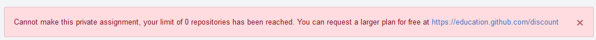
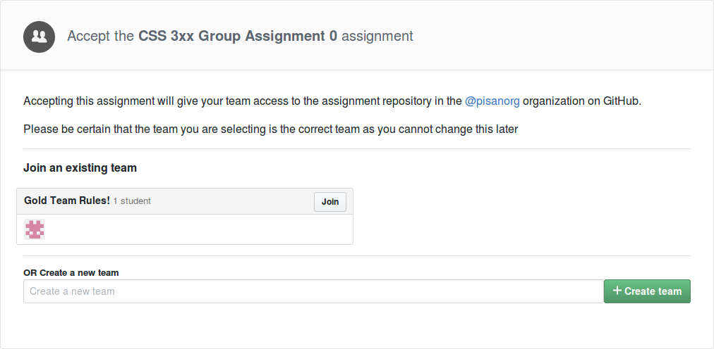
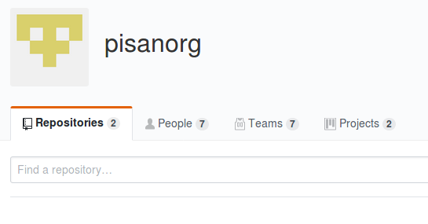
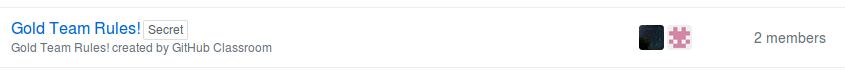
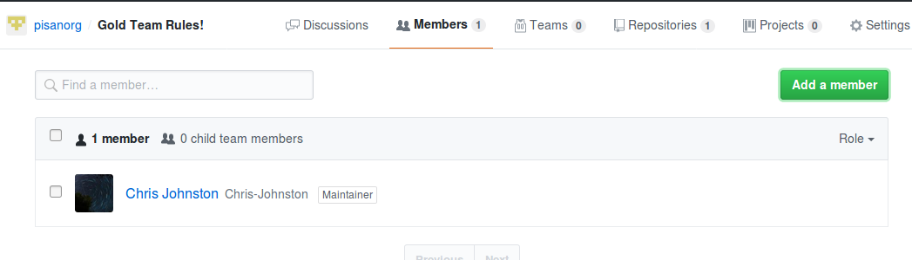
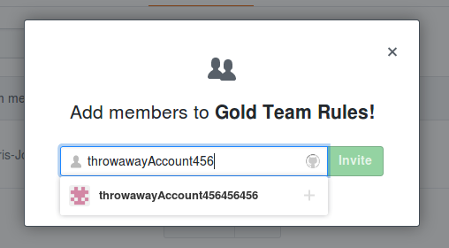

# Creating an Assignment

First, sign into [classroom.github.com/classrooms][class-dash]. Choose the classroom that you wish to create the assignment for.
If you have not created a classroom, please read **TODO - Create a Classroom Guide** first.

Click the green _"New Assignment"_ button, which will let you choose between creating an individual assignment, or a group assignment.

## Individual Assignments

![Screenshot of the "New Individual Assignment" page.][screenshot-new-indiv]

On this page, you can configure the parameters for the new assignment.
By default GitHub uses some settings which may be a poor fit for graded
assignments, so these should be changed.

### Repository Privacy

This setting is _"Public"_ by default, but
for most assignments, you'll want to have this set to _"Private"_.

This controls who can see the assigments. These will always be created
under your GitHub organization, so you'll retain full control of them at all
times.

In addition, you can authorize other users like graders and assistants to have
access to these repos.

As long as the repo is private, it can not be accessed publicly.

Students **do not** have to accept the GitHub student pack, verify their e-mail
address as a `.edu`, or pay any money to have access to these private repos,
because they belong to this organization.

If you do not have the GitHub Education discount (or do not pay) for private repos, you will
see this error when trying to create an assignment with private repos:



### Admin Access

Typically, you'll want to leave this unchecked. Giving students Admin access 
can let them do things that you may not want, like deleting the repo or making
it public.

Disabling admin access does not prevent students from force-pushing to the master
branch. This means that they will be able to amend commit messages, authors,
and timestamps.

### Starter Code

By providing a starter repository (which is optional), all student repos will start with a set of 
files in their repository. This may be useful for distributing instructions or sample files.

Note that all students will have access to the history contained in this repo, including access
to the changes that have been made to the sample repo. Do not keep a solution to the assignment
in the same repository.

### Deadlines

You can set a deadline of when code is due. Note that this will not prevent students from making
changes after the deadline, but when viewing project repos from the website, the submission
will count as the last commit pushed before midnight. Note that as of writing, the github classroom
assistant client does not respect these deadlines.

The absolute best way to ensure that students work on assignments past the due date is to
download them as soon as they are due.

#### The Commit Timestamp Issue

GitHub Classroom has a fairly significant flaw with it's implementation of assignment deadlines.

[Git allows users to amend the date of commits,](https://stackoverflow.com/questions/454734/how-can-one-change-the-timestamp-of-an-old-commit-in-git)
and commit timestamps are set by the **local time** on the machine.
If a machines time is set to some time in the past or future, then commit timestamps will use this time.

GitHub Classroom does **not** validate the timestamps of commits.
This potentially means that students could bypass assignment deadlines.

In addition, students also have the ability to amend commits.

#### Mitigating the Commit Timestamp Issue

There are a few ways to mitigate this issue:

1. Download all of the submissions as soon as possible after the deadline.
    This may not be ideal for a strict deadline, and does not prevent submissions after the deadline.

2. Require students to turn in their last commit hash (that they want graded) to Canvas, on the due date.
    The time would be confirmed with Canvas, and the student would have no way to get around it.

3. Set up a webhook in GitHub, and use it to notify you when students push commits (could be to an empty Slack or Discord channel).

### Recommended Settings

These settings are a good starting point when creating a new assignment.

![Screenshot of recommended settings for creating a new assignment.][screenshot-recommended-indiv]

## Managing a New Individual Assignment

After creating a new assignment, you should see a confirmation dialog similar to the following:

![Screenshot of new assignment created confirmation.][screenshot-assignment-confirm]

This page allows you to manage the assignment and view the state of all submissions made
to this assignemnt.

The _"Download Repositories"_ button will open the [GitHub Classroom Assistant software][classroom-assistant]
and open this assignment. This tool enables bulk downloading of all assignments,
and is available for Linux, Windows, and MacOS.

**Important Note:** At the time of writing, GitHub Classroom Assistant is missing some
important functionality. It currently does not respect the deadlines of assignments, and will
only check out assignment repositories to the latest contents of the master branch at the time
of downloading. This means that if you are using Classroom Assistant, you should be very sure
to check the timestamp of the last commit.
[I've filed an Issue for this feature on their project repo, where you can view the status of 
the request as changes develop.](https://github.com/education/classroom-assistant/issues/119)

You can manage the settings from the creation step using the
_"Assignment Settings"_ button.


## Sending Assignments to Students

First, you'll need to ensure that your students are signed up with GitHub and GitHub classroom, and that
they are added to your class roster.

When students click on the assignment invitation link, they'll be prompted to create a new repository
under _your classroom organization._ This means that you (and your graders) will have full control
over their repositories, and that a student cannot make their assignment public using GitHub
(this is still possible, though).

Once some students have joined this assignment, you'll see their new repositories being created
and they'll show up on the repository dashboard.

## Gathering Completed Assignments

Once an assignment is past it's deadline, the GitHub assignment dashboard will show that the
assignment deadline has passed, and which students have submitted their assignments.

By clicking on the _"Submitted"_ button, you can view each student's repository at the time
of the submission. This is always going to be their last commit before the assignment due date.
**Be mindful of which branch/commit you are viewing**, as it is very easy to view the latest commit
on `master`, which may not be the same as the last commit before the deadline.
When grading, alwasy verify the last commit of the repo.

Students are not locked out of assignments past their due date, and retain the ability to make changes
after an assignment is due.

Assignments can be viewed in the web client, one-by-one, or with the use of the [classroom assistant tool][classroom-assistant].

### Classroom Assistant

[First, download the classroom assistant software.][classroom-assistant] Log in using your GitHub account.

After you log in, you'll be prompted to enter the assignment URL. **This is not the same URL that is sent to your students.** Instead, this is the URL of your assignment dashboard page. You can
also set this by using the "Download Repositories" button on the assignment dashboard page.

Once confirming the assignment that you wish to archive, you can select which of the student's assignments you'd like to download, and the path where they will be downloaded. Then, you can start the process. This is a very fast process, especially if you are dealing only with text.

**Note that you will be cloning the latest version of each repo from the time you've downloaded it, and not from the assignment deadline. Changes made after the deadline will appear here.**

Classroom Assistant will download projects under the following folder structure:

```
/<starting directory as specified>/<assignment title>/<student github username>/
```
It may be beneficial to require that students include their full name and student IDs in their README files,
or have a table of names and usernames.

## Group Assignments

In addition to individual assignments, GitHub Classroom supports group assignments.
These allow multiple users to work together.

![Screenshot of the "Create new Group Assignment" page.][group-assignment]

This page features some settings that are not specififed on the individual
assignment page. Here you can set the maximum number of members in each team,
and name the set of teams that will be created after this step.

The process is nearly the same for students to join the assignment. They'll be prompted
to either create or join a group when accepting the assignment.



### Managing Group Members

If you need to manage the set
of users that are in a team, you can do so by visiting the teams page under the
organization itself, and adding or removing group members. Students are able
to leave teams, and join other teams themselves. Currently, there is no way
to prevent users from leaving and joining other teams.

To do this:

1. Navigate to your GitHub organization. github.com/orgname



2. Click on the "Teams" tab.



3. Click on the name of the team you wish to manage.

4. Click on the "Members" tab.



5. Use this page to add and remove team members.



[class-dash]: https://classroom.github.com/classrooms
[screenshot-new-indiv]: img/new-individual-assignment.png
[screenshot-recommended-indiv]: img/indiv-recommended.png
[screenshot-assignment-confirm]: img/assignment-confirmation.png
[student-pack]: https://education.github.com/pack
[classroom-assistant]: https://classroom.github.com/assistant
[group-assignment]: img/new-group-assignment.png