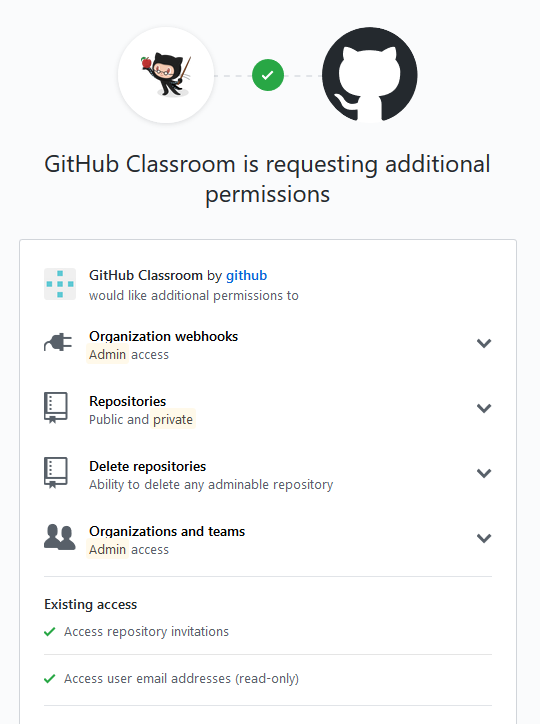
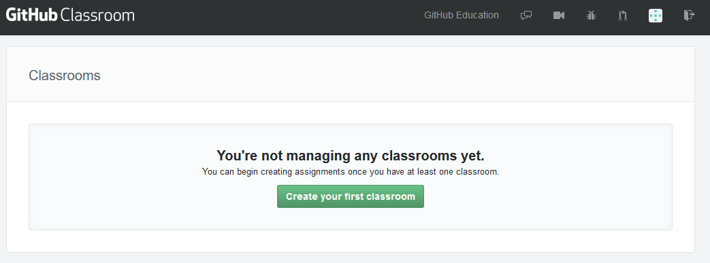
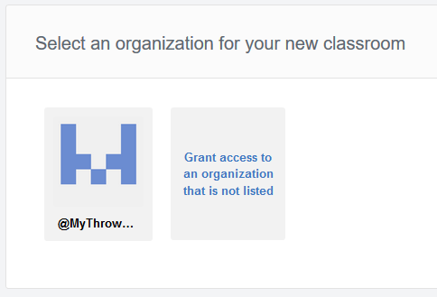
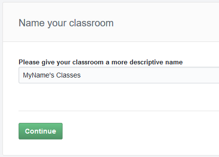
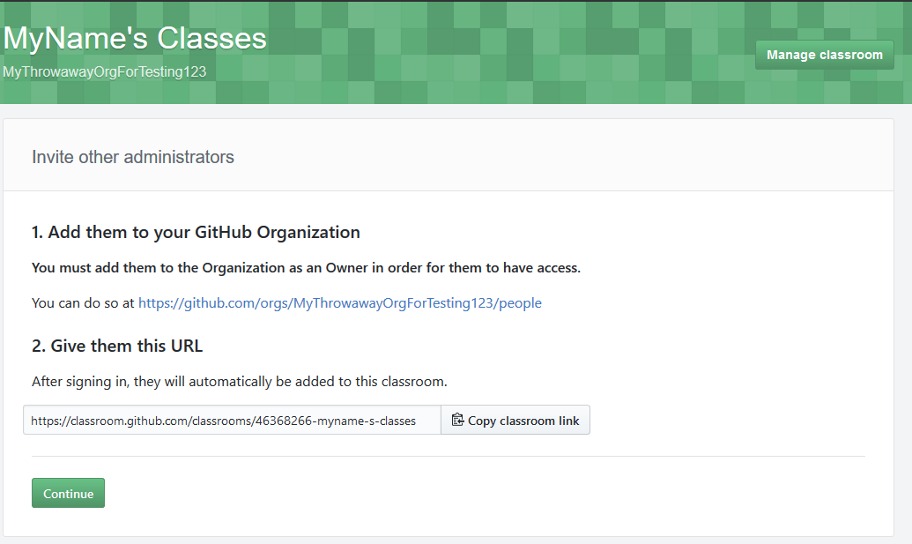
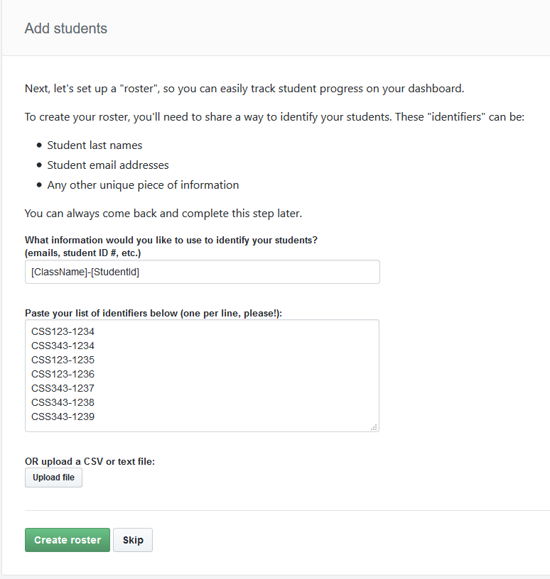
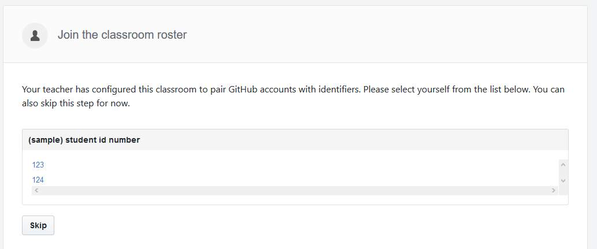
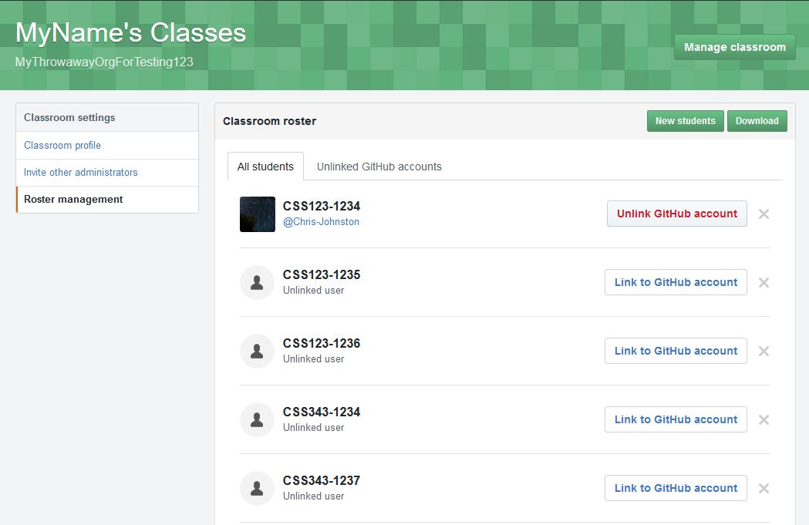

# Creating a Classroom

This guide will explain the steps for creating a classroom and a roster in GitHub classroom,
with a recommendation for how this will work for multiple sections.

[This guide assumes that you have already signed up for GitHub Education, and that your request was approved.](github-education-sign-up.md)
You will need to have set up a new organization.

Even if you are hosting multiple classes, or multiple sections of the same class, you'll only need one GitHub organization.
This is easier to manage, as you won't have to go back and re-apply for the Educator discount for each class or section.
**You can only have one classroom per organization.**

## Setting up a Classroom

1. First, navigate to [classroom.github.com](https://classroom.github.com/) and sign in. You'll need to authorize GitHub Classroom 
to have special permissions to your GitHub account.



2. You'll be [redirected to the classroom manager page](https://classroom.github.com/classrooms). Click the big green button labeled
_"Create your first classroom"_.



3. Choose the organization that you created that was given the GitHub Education discount.



4. Give your classroom a name. If you are teaching multiple sections or classes, you may want to name it something generic.



5. If you have graders, you'll want to invite them to your organization using these steps. You don't have to do this now. This will give them
read-access to student's repositories.



6. (Optional) Create a roster.

## Creating a Roster

GitHub Classroom has a "Roster" system, which can be used to identify students by an identifier that you give them,
instead of their GitHub username. We still recommend asking students to create a `README.md` or `README.txt` that has
their full name.



This step does not magically _"add"_ students to your class.
When students first log into GitHub classroom, they'll be prompted to select their roster identifier out of a list.
Once they've accepted their first assignment from your class they'll be marked as _"in"_ the class.



They will only be prompted to do this once. As an administrator, you'll always be able to unassign and re-assign students to roster
identifiers at any time.

### Choosing a Good Roster Identifier

A student's full name, net id, or student id should all make good identifiers for a roster, and is information that
should be easy to obtain as an instructor. It must be unique.

```
1234567 (student id)
Student123 (net id)
ChrisJohnston (full name)
```

If you are hosting multiple sections of a class, or multiple classes in the same GitHub organization, you'll want to
also include some sort of identifier for the class, like the section letter or the course code.

```
CSS343-ChrisJohnston (course code)
CSS342-ChrisJohnston (course code)
A-ChrisJohnston (section identifier)
B-ChrisJohnston (section identifier)
```

We recommend doing this so that students don't have to go through every identifier to find theirs, and it's easy
to associate identifiers with assignments.

**If you have a student that is in more than one class or section at a time, you can ask them to use either identifier.**
It shouldn't matter, they can just be an exception.

### Manually setting and resetting a roster

If a student has accidentally selected the wrong roster identifier, you can manually re-assign identifiers for them.

1. Navigate to your classroom's page, and hit the _"Manage Classroom"_ button.


2. Next click on the _"Roster Management"_ tab.



From here, you can view all of the students and their linked GitHub accounts.

You can also create and remove classroom identifiers (useful for duplicate students).

**You will only be able to link GitHub accounts of students who have already accepted an assignment.**
If a student selects to _"skip"_ the step of selecting their identifier, then you'll see their username
under the _"Unlinked GitHub accounts"_ tab.

The _"Download"_ button will let you download a CSV containing roster identifiers, GitHub usernames, and group names (if any).
